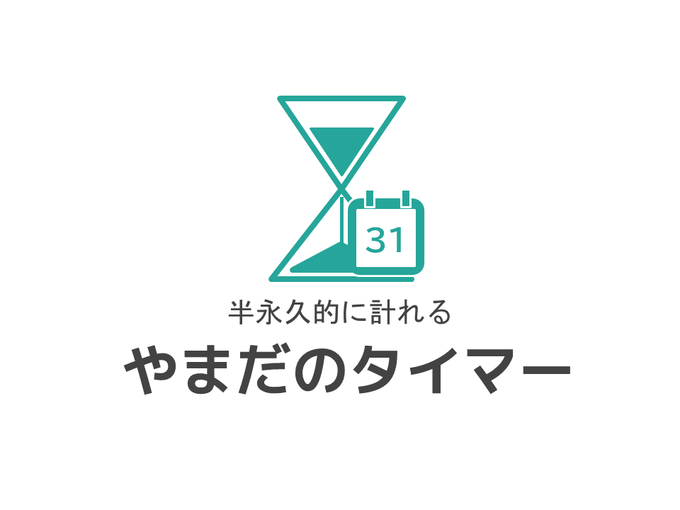

# Countdown Timer
半永久的に計れるタイマー  

[デモを開く](https://r-40021.github.io/countdown-timer/index.html?date=2021/08/31&time=23:59&title=%E5%A4%8F%E4%BC%91%E3%81%BF%E3%81%AE%E7%B5%82%E3%82%8F%E3%82%8A)

# スクリーンショット
#### ライトモード

#### ダークモード

#### 日付の設定

#### 時刻の設定

#### プッシュ通知

# How to Use
**使い方は超シンプル**
1. アラームを鳴らしたい時刻を設定する
1. SETボタンを押す  
# 特長
1. 目覚まし時計とタイマーのいいとこどりをしたアプリです。
1. 設定時刻はパラメーターとローカルストレージに格納されます。
1. 残り時間がページタイトルにリアルタイムで反映されますので、他の作業をしていても残り時間が分ります。
1. アラーム音を好きなものに変えられます。
2. このアプリを使っている間、パソコンやスマートフォンがスリープすることはありません。
3. 時間になったらプッシュ通知が届きます。(PC)
4. 全画面表示モードを搭載。
5. 普通のタイマーのようにも使えます。
# プライバシー
このWEBアプリには、プライバシーの観点からアクセス解析をつけていません。画面上のシェアボタンから、Twitterで"#やまだのタイマー"と"#やまだけんいち"をつけてツイートして頂ければ、こちらも大体のアクセス数を把握できますので、もしよろしければご協力ください。
# 動作確認済み環境
- Windows 10 (64bit)
- Google Chrome v.92
- Microsoft Edge(Chromium) v.92
- Safari on iOS 14.5.1 (全画面表示機能は利用できません)
# ライセンス表示
- [Materialize](https://github.com/dogfalo/materialize) &copy; 2014-2019 Materialize
- [Push.js](https://github.com/Nickersoft/push.js) &copy; 2016 Tyler Nickerson
- [NoSleep.js](https://github.com/richtr/NoSleep.js) &copy; Rich Tibbett
- [howler.js](https://github.com/goldfire/howler.js) &copy; 2013-2020 James Simpson and GoldFire Studios, Inc.
- ["時計　アラーム03"](https://otologic.jp/free/se/clock01.html) by [OtoLogic](https://otologic.jp/) is licensed under [CC BY 4.0](https://creativecommons.org/licenses/by/4.0/legalcode)
